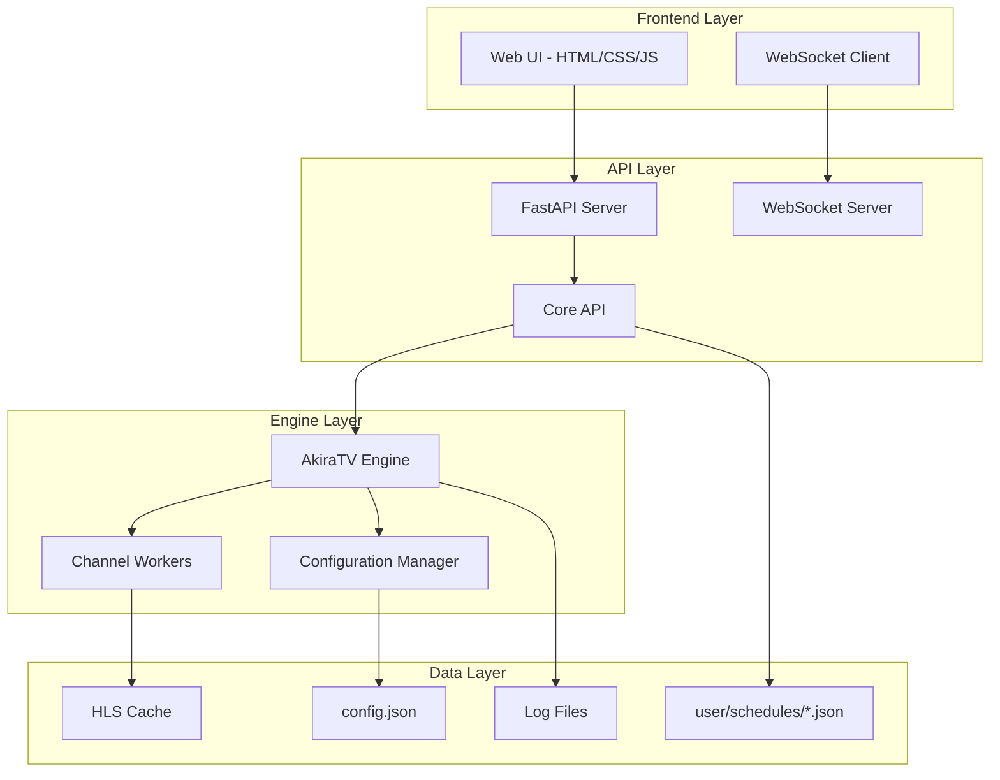
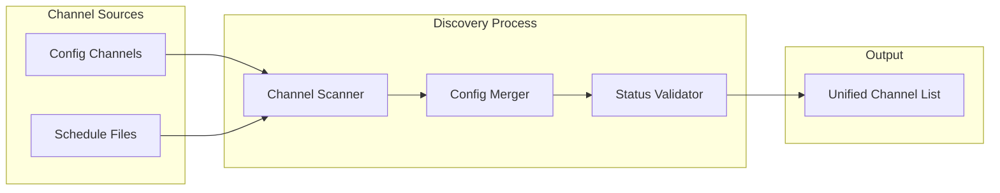

# Design Document: AkiraTV Web UI Fix and Enhancement

## Overview

This design addresses critical channel discovery issues in the AkiraTV web UI and transforms it into a comprehensive management interface. The primary issue is that the `get_channels()` method in `core_api.py` searches for schedule files in the wrong directory (`.` instead of `user/schedules/`), causing only 2 channels to appear instead of all 11 configured channels.

The solution involves fixing the channel discovery logic, enhancing the web UI with complete management capabilities, and establishing it as the primary interface for AkiraTV administration.

## Architecture

### System Components



### Channel Discovery Architecture



## Components and Interfaces

### 1. Enhanced Channel Discovery Service

**Location:** `core_api.py` - `get_channels()` method

**Current Issue:**
```python
# BROKEN: Looking in wrong directory
for schedule_file in Path(".").glob("schedule_*.json"):
```

**Fixed Implementation:**
```python
# FIXED: Look in correct directory
schedules_dir = Path("user/schedules")
if schedules_dir.exists():
    for schedule_file in schedules_dir.glob("schedule_*.json"):
```

**Interface:**
```python
class ChannelDiscoveryService:
    def discover_all_channels(self) -> List[ChannelStatus]:
        """Discover channels from all sources"""
        
    def scan_config_channels(self) -> Dict[str, Dict]:
        """Get channels from config.json"""
        
    def scan_schedule_files(self) -> Dict[str, Dict]:
        """Get channels from user/schedules/"""
        
    def merge_channel_data(self, config_channels: Dict, schedule_channels: Dict) -> List[ChannelStatus]:
        """Merge and validate channel data"""
```

### 2. Enhanced Web UI Components

**Main Dashboard Component:**
```javascript
class AkiraTVDashboard {
    constructor() {
        this.api = new AkiraTVAPI();
        this.websocket = new AkiraTVWebSocket();
        this.channelManager = new ChannelManager();
        this.configManager = new ConfigManager();
    }
    
    async initialize() {
        await this.loadSystemStatus();
        await this.loadChannels();
        this.setupWebSocket();
        this.setupEventHandlers();
    }
}
```

**Channel Management Component:**
```javascript
class ChannelManager {
    async loadChannels() {
        // Load all channels with enhanced status
    }
    
    async toggleChannel(channelName, enabled) {
        // Enable/disable channel with immediate feedback
    }
    
    async updateChannelConfig(channelName, config) {
        // Update channel configuration
    }
    
    async startChannel(channelName) {
        // Start individual channel
    }
    
    async stopChannel(channelName) {
        // Stop individual channel
    }
}
```

### 3. Real-time Communication Layer

**WebSocket Event Types:**
```typescript
interface WebSocketEvents {
    // System events
    'engine_started': { timestamp: string };
    'engine_stopped': { timestamp: string };
    'system_stats': SystemStats;
    
    // Channel events
    'channel_status_changed': { channel: string, status: string };
    'channel_enabled': { channel: string };
    'channel_disabled': { channel: string };
    'video_queued': { channel: string, video: string };
    
    // Configuration events
    'config_updated': { section: string, changes: object };
    'schedule_reloaded': { channel?: string };
}
```

### 4. Configuration Management Interface

**Config Manager Component:**
```javascript
class ConfigManager {
    async getConfig() {
        // Get complete configuration
    }
    
    async updateConfig(section, updates) {
        // Update configuration section
    }
    
    async saveConfig() {
        // Save configuration to disk
    }
    
    async backupConfig() {
        // Create configuration backup
    }
    
    async restoreConfig(backupId) {
        // Restore from backup
    }
}
```

## Data Models

### Enhanced Channel Status Model

```python
@dataclass
class EnhancedChannelStatus:
    # Basic info
    name: str
    type: str  # "linear" | "vod" | "dynamic"
    enabled: bool
    status: str  # "running" | "stopped" | "error" | "starting" | "stopping"
    
    # Runtime info
    now_playing: str = ""
    next_program: str = ""
    viewers: int = 0
    uptime: float = 0.0
    
    # Configuration
    transcoding_enabled: bool = False
    subtitles_enabled: bool = False
    
    # URLs
    stream_url: str = ""
    epg_url: str = ""
    
    # Statistics
    total_viewers_today: int = 0
    bandwidth_usage: float = 0.0  # Mbps
    error_count: int = 0
    last_error: Optional[str] = None
    
    # Schedule info (for linear channels)
    schedule_file: Optional[str] = None
    program_count: int = 0
    
    # Library info (for VOD channels)
    video_count: int = 0
    total_duration: float = 0.0  # seconds
```

### System Statistics Model

```python
@dataclass
class SystemStatistics:
    # Engine status
    is_running: bool
    uptime: float
    version: str
    
    # Performance metrics
    cpu_usage: float  # percentage
    memory_usage: float  # percentage
    disk_usage: float  # percentage
    
    # Streaming metrics
    total_viewers: int
    total_bandwidth: float  # Mbps
    active_channels: int
    
    # Content metrics
    total_videos: int
    total_duration: float  # hours
    storage_used: float  # GB
    
    # Error tracking
    error_count_24h: int
    warning_count_24h: int
    last_restart: Optional[datetime]
```

### Configuration Schema

```python
class ConfigurationSchema:
    """Enhanced configuration schema with validation"""
    
    ffmpeg: FFmpegConfig
    storage: StorageConfig
    output: OutputConfig
    streaming: StreamingConfig
    channels: Dict[str, ChannelConfig]
    worker: WorkerConfig
    ui: UIConfig
    security: SecurityConfig  # New
    monitoring: MonitoringConfig  # New
```

## Error Handling

### Error Classification System

```python
class ErrorSeverity(Enum):
    INFO = "info"
    WARNING = "warning"
    ERROR = "error"
    CRITICAL = "critical"

class SystemError:
    severity: ErrorSeverity
    component: str  # "channel", "engine", "config", "api"
    message: str
    timestamp: datetime
    context: Dict[str, Any]
    suggested_action: Optional[str]
```

### Error Recovery Mechanisms

1. **Channel Recovery:** Automatic restart of failed channels with exponential backoff
2. **Configuration Recovery:** Automatic rollback to last known good configuration
3. **API Recovery:** Graceful degradation when engine is unavailable
4. **WebSocket Recovery:** Automatic reconnection with connection state management

### User-Friendly Error Messages

```javascript
const ERROR_MESSAGES = {
    'channel_not_found': 'Channel "{channel}" was not found. Please check the channel name.',
    'engine_not_running': 'The streaming engine is not running. Please start it first.',
    'config_invalid': 'Configuration is invalid: {details}. Please check your settings.',
    'file_not_found': 'Video file not found: {path}. Please verify the file exists.',
    'permission_denied': 'Permission denied. Please check file permissions.',
    'network_error': 'Network connection failed. Please check your connection.',
    'websocket_disconnected': 'Real-time connection lost. Attempting to reconnect...'
};
```

## Testing Strategy

### Dual Testing Approach

The testing strategy combines unit tests for specific functionality and property-based tests for comprehensive validation:

**Unit Tests:**
- Focus on specific examples, edge cases, and error conditions
- Test individual components and integration points
- Validate error handling and recovery mechanisms
- Test UI interactions and user workflows

**Property-Based Tests:**
- Verify universal properties across all inputs
- Test system behavior with randomized data
- Validate configuration consistency and channel discovery
- Ensure data integrity across operations

**Property-Based Testing Configuration:**
- Use Hypothesis for Python backend testing
- Use fast-check for JavaScript frontend testing
- Minimum 100 iterations per property test
- Each test tagged with: **Feature: akiratv-web-ui-fix, Property {number}: {property_text}**

### Test Categories

1. **Channel Discovery Tests**
   - Unit tests for specific channel configurations
   - Property tests for channel merging logic
   - Integration tests for file system operations

2. **API Endpoint Tests**
   - Unit tests for each REST endpoint
   - Property tests for data validation
   - Integration tests for WebSocket communication

3. **UI Component Tests**
   - Unit tests for component rendering
   - Property tests for state management
   - End-to-end tests for user workflows

4. **Configuration Management Tests**
   - Unit tests for config validation
   - Property tests for config merging
   - Integration tests for persistence operations

## Correctness Properties

*A property is a characteristic or behavior that should hold true across all valid executions of a system—essentially, a formal statement about what the system should do. Properties serve as the bridge between human-readable specifications and machine-verifiable correctness guarantees.*

### Property 1: Channel Discovery Completeness
*For any* combination of config.json channels and user/schedules/ files, the channel discovery process should find and return all channels from both sources with properly merged configuration data.
**Validates: Requirements 1.1, 1.2, 1.3, 1.5**

### Property 2: Configuration Persistence Consistency
*For any* configuration change made through the web UI, the change should be immediately persisted to config.json and reflected in the system state without data loss.
**Validates: Requirements 2.4, 5.2, 10.2**

### Property 3: Real-time Status Propagation
*For any* channel status change or system event, all connected WebSocket clients should receive the update within the specified time limits and the UI should reflect the change.
**Validates: Requirements 2.5, 3.1, 3.3, 3.4**

### Property 4: UI Information Completeness
*For any* channel, system status, or monitoring data displayed in the web UI, all required information fields should be present and correctly formatted in the rendered output.
**Validates: Requirements 2.1, 3.2, 7.1, 7.2, 8.1**

### Property 5: Channel Control Interface Consistency
*For any* channel type (linear, VOD, dynamic), the web UI should provide appropriate control interfaces and all control operations should function correctly for that channel type.
**Validates: Requirements 2.2, 4.1, 4.2, 4.3, 4.4**

### Property 6: Configuration Validation and Backup
*For any* configuration update, the system should validate the changes, create automatic backups, and provide rollback capabilities while maintaining data integrity.
**Validates: Requirements 5.3, 10.1, 10.3**

### Property 7: WebSocket Connection Resilience
*For any* WebSocket connection state (connected, disconnected, reconnecting), the system should handle the state appropriately, attempt automatic recovery, and provide clear user feedback.
**Validates: Requirements 3.4, 3.5**

### Property 8: Error Handling and User Feedback
*For any* error condition or user operation, the system should provide appropriate feedback messages, loading indicators, and recovery suggestions to guide the user.
**Validates: Requirements 6.2, 6.5**

### Property 9: Data Management Operations
*For any* file operation, content upload, or library management action, the system should handle the operation correctly, validate the data, and maintain system integrity.
**Validates: Requirements 8.2, 8.3, 8.5**

### Property 10: Security and Access Control
*For any* user authentication attempt or system access, the system should enforce proper security measures, maintain audit logs, and protect against unauthorized access.
**Validates: Requirements 9.1, 9.3, 9.4**

### Property 11: Schedule Management Consistency
*For any* schedule modification or timeline operation, the changes should be properly applied, validated, and reflected in both the UI and the underlying schedule files.
**Validates: Requirements 4.2, 8.4**

### Property 12: System Monitoring and Diagnostics
*For any* system performance metric or diagnostic check, the monitoring system should provide accurate data, appropriate alerts, and actionable recommendations.
**Validates: Requirements 7.3, 7.4, 7.5**

### Property 13: Content Library Management
*For any* video file or library content, the system should properly extract metadata, validate format compatibility, and provide complete browsing capabilities.
**Validates: Requirements 8.1, 8.5**

### Property 14: Configuration Import/Export Round-trip
*For any* valid system configuration, exporting then importing the configuration should produce an equivalent system state.
**Validates: Requirements 5.5, 10.5**

### Property 15: Data Pagination and Filtering
*For any* large dataset displayed in the UI, the pagination and filtering mechanisms should work correctly and maintain data consistency across operations.
**Validates: Requirements 6.4**