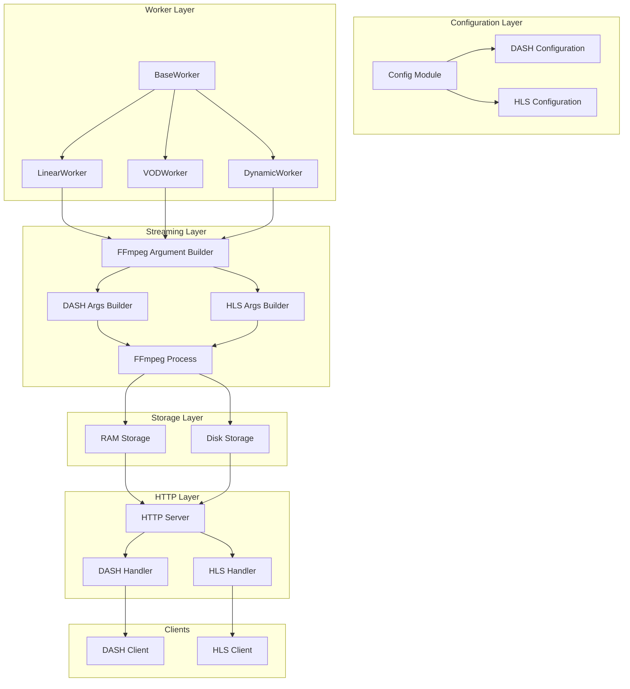
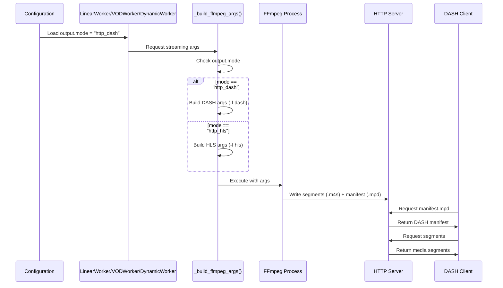

# Design Document: DASH Streaming Support

## Overview

This feature adds Dynamic Adaptive Streaming over HTTP (DASH) as an alternative streaming protocol alongside the existing HLS implementation in AkiraTV. DASH provides better cross-platform compatibility, especially for web browsers and smart TVs, while maintaining feature parity with the current HLS setup. The implementation follows the existing config-driven architecture and integrates seamlessly with the worker-based streaming pipeline.

## Architecture

The DASH streaming implementation extends the existing AkiraTV architecture with minimal changes, integrating seamlessly alongside the current HLS streaming pipeline.



### Component Relationships

1. **Configuration Layer**: Central configuration management supporting both HLS and DASH streaming modes with protocol-specific parameters.

2. **Worker Layer**: Worker classes (LinearWorker, VODWorker, DynamicWorker) inherit from BaseWorker and use the FFmpeg Argument Builder to construct streaming commands based on configuration.

3. **Streaming Layer**: The FFmpeg Argument Builder dispatches to DASH or HLS specific builders, which generate appropriate command-line arguments for FFmpeg execution.

4. **HTTP Layer**: The HTTP server routes requests to DASH or HLS handlers based on URL patterns (`/dash/` or `/hls/`), serving manifests and segments with correct MIME types.

5. **Storage Layer**: Supports both RAM-based (for low-latency streaming) and disk-based storage, shared between HLS and DASH implementations.

6. **Client Layer**: DASH clients request MPD manifests and MP4 segments, while HLS clients request M3U8 playlists and TS segments.

### Data Flow

1. Configuration is loaded at startup, determining the streaming mode
2. Workers build FFmpeg arguments based on the configured protocol
3. FFmpeg generates segments and manifests to storage
4. HTTP server serves content to connected clients
5. Clients adaptively stream based on network conditions

## Main Algorithm/Workflow



## Core Interfaces/Types

```python
from typing import Literal, Dict, Any, Optional
from pathlib import Path
from dataclasses import dataclass

# Streaming protocol types
StreamingProtocol = Literal["http_hls", "http_dash", "ram_http"]

@dataclass
class HLSConfig:
    """HLS-specific streaming configuration."""
    segment_time: int = 6
    playlist_size: int = 4

@dataclass
class DASHConfig:
    """DASH-specific streaming configuration."""
    segment_duration: int = 6
    fragment_duration: int = 6
    min_buffer_time: float = 2.0
    playlist_size: int = 4

@dataclass
class OutputConfig:
    """Output configuration for streaming."""
    mode: StreamingProtocol = "http_hls"
    http: Dict[str, Any] = None  # {"port": 8081, "bind": "0.0.0.0"}
    hls: HLSConfig = None
    dash: DASHConfig = None

@dataclass
class FFmpegOutputArgs:
    """FFmpeg output arguments container."""
    format: str
    format_args: list[str]
    output_path: str
    segment_pattern: str
```

## Key Functions with Formal Specifications

### Function 1: get_streaming_output_path()

```python
def get_streaming_output_path(self, channel: str) -> Path
```

**Preconditions:**
- `self.data` is properly initialized with output configuration
- `channel` is a non-empty string
- Storage configuration exists with valid path settings

**Postconditions:**
- Returns a Path object pointing to the channel's output directory
- The returned path incorporates the channel name as a subdirectory
- The path respects the configured storage type (ram vs disk)
- No exceptions are raised when configuration is valid

**Loop Invariants:** N/A (no loops)

### Function 2: build_dash_ffmpeg_args()

```python
def build_dash_ffmpeg_args(
    self, 
    input_path: Path, 
    output_dir: Path, 
    channel: str,
    transcoding_args: list[str]
) -> list[str]
```

**Preconditions:**
- `input_path` exists and is a valid media file
- `output_dir` exists or can be created
- `channel` is a non-empty string
- `transcoding_args` is a list of valid FFmpeg encoding arguments

**Postconditions:**
- Returns a complete list of FFmpeg arguments for DASH output
- The arguments produce valid MPD manifest at `{output_dir}/manifest.mpd`
- Segment files follow pattern `{output_dir}/seg_{index}.m4s`
- All segment files are valid fragmented MP4 containers
- No modifications are made to the input file

**Loop Invariants:** N/A

### Function 3: build_hls_ffmpeg_args()

```python
def build_hls_ffmpeg_args(
    self, 
    input_path: Path, 
    output_dir: Path, 
    channel: str,
    transcoding_args: list[str]
) -> list[str]
```

**Preconditions:**
- `input_path` exists and is a valid media file
- `output_dir` exists or can be created
- `channel` is a non-empty string
- `transcoding_args` is a list of valid FFmpeg encoding arguments

**Postconditions:**
- Returns a complete list of FFmpeg arguments for HLS output
- The arguments produce valid M3U8 playlist at `{output_dir}/index.m3u8`
- Segment files follow pattern `{output_dir}/seg_{index}.ts`
- No modifications are made to the input file

**Loop Invariants:** N/A

### Function 4: serve_dash_manifest()

```python
async def serve_dash_manifest(self, request) -> web.Response
```

**Preconditions:**
- Request path contains a valid channel identifier
- DASH configuration is loaded in self.config

**Postconditions:**
- Returns HTTP 200 with valid MPD XML content if manifest exists
- Returns HTTP 404 if manifest does not exist
- Response includes proper CORS headers
- No side effects on server state

**Loop Invariants:** N/A

## Algorithmic Pseudocode

### Main Processing Algorithm: Streaming Mode Selection

```pascal
ALGORITHM build_streaming_args(config, input_path, output_dir, channel, transcoding_args)
INPUT: config of type Config, input_path of type Path, output_dir of type Path, 
       channel of type String, transcoding_args of type List[String]
OUTPUT: args of type List[String]

BEGIN
  ASSERT config IS NOT NULL
  ASSERT input_path.exists() = true
  ASSERT channel IS NOT empty
  
  // Step 1: Determine streaming mode from configuration
  mode ← config.data["output"]["mode"]
  
  // Step 2: Build base FFmpeg arguments common to all modes
  args ← ["ffmpeg", "-v", "verbose", "-re", "-threads", "2"]
  
  // Step 3: Add input-specific arguments
  args.extend(["-f", "concat", "-safe", "0", "-i", str(input_path)])
  
  // Step 4: Add transcoding arguments
  args.extend(transcoding_args)
  
  // Step 5: Select output format based on mode
  IF mode = "http_dash" THEN
    dash_args ← build_dash_output_args(config, output_dir, channel)
    args.extend(dash_args)
  ELSIF mode IN ("http_hls", "ram_http") THEN
    hls_args ← build_hls_output_args(config, output_dir, channel)
    args.extend(hls_args)
  ELSE
    RAISE ValueError("Unsupported output mode: " + mode)
  END IF
  
  ASSERT args IS NOT empty
  ASSERT args CONTAINS valid FFmpeg command
  
  RETURN args
END
```

**Preconditions:**
- Config object is properly initialized
- Input path points to an existing file
- Channel name is a valid identifier
- Transcoding arguments are valid FFmpeg parameters

**Postconditions:**
- Returns complete FFmpeg argument list
- Arguments are valid for FFmpeg execution
- Output format matches the configured mode
- No file system modifications occur

**Loop Invariants:** N/A

### DASH Output Arguments Algorithm

```pascal
ALGORITHM build_dash_output_args(config, output_dir, channel)
INPUT: config of type Config, output_dir of type Path, channel of type String
OUTPUT: dash_args of type List[String]

BEGIN
  ASSERT config.data["output"]["dash"] EXISTS
  
  // Step 1: Extract DASH configuration
  dash_conf ← config.data["output"]["dash"]
  segment_duration ← dash_conf.get("segment_duration", 6)
  fragment_duration ← dash_conf.get("fragment_duration", 6)
  min_buffer_time ← dash_conf.get("min_buffer_time", 2.0)
  playlist_size ← dash_conf.get("playlist_size", 4)
  
  // Step 2: Build manifest path
  manifest_path ← output_dir / "manifest.mpd"
  
  // Step 3: Build segment pattern
  segment_pattern ← str(output_dir / "seg_$Number$.m4s")
  
  // Step 4: Construct DASH-specific FFmpeg arguments
  dash_args ← [
    "-map", "0:v:0?",
    "-map", "0:a:0?",
    "-c:v", "libx264",
    "-c:a", "aac",
    "-bf", "1",
    "-keyint_min", "120",
    "-g", "120",
    "-sc_threshold", "0",
    "-profile:v", "high",
    "-preset", "fast",
    "-f", "dash",
    "-seg_duration", str(segment_duration),
    "-frag_duration", str(fragment_duration),
    "-window_size", str(playlist_size),
    "-extra_window_size", str(playlist_size),
    "-min_playback_rate", "1.0",
    "-media_seg_name", "seg_$Number$.m4s",
    "-init_seg_name", "init.mp4",
    "-adaptation_sets", "id=0,streams=v id=1,streams=a",
    str(manifest_path)
  ]
  
  RETURN dash_args
END
```

**Preconditions:**
- DASH configuration exists in config structure
- Output directory is writable
- Channel name is valid

**Postconditions:**
- Returns valid DASH FFmpeg arguments
- Segment duration matches configuration
- Manifest will be created at specified path
- Segment files follow naming convention

**Loop Invariants:** N/A

### Configuration Update Algorithm

```pascal
ALGORITHM update_config_for_dash(config_path)
INPUT: config_path of type Path
OUTPUT: success of type Boolean

BEGIN
  // Step 1: Load existing configuration
  config ← load_config(config_path)
  
  // Step 2: Check if output section exists
  IF config["output"] DOES NOT EXIST THEN
    config["output"] ← {}
  END IF
  
  // Step 3: Add DASH configuration if not present
  IF config["output"]["dash"] DOES NOT EXIST THEN
    config["output"]["dash"] ← {
      "segment_duration": 6,
      "fragment_duration": 6,
      "min_buffer_time": 2.0,
      "playlist_size": 4
    }
  END IF
  
  // Step 4: Validate mode values
  valid_modes ← ["http_hls", "http_dash", "ram_http"]
  current_mode ← config["output"].get("mode", "http_hls")
  
  IF current_mode NOT IN valid_modes THEN
    config["output"]["mode"] ← "http_hls"
  END IF
  
  // Step 5: Save updated configuration
  save_config(config_path, config)
  
  RETURN true
END
```

**Preconditions:**
- Configuration file path is valid
- File is readable and writable

**Postconditions:**
- Configuration includes DASH section
- Mode is set to valid value
- Original configuration values are preserved
- File is successfully saved

**Loop Invariants:** N/A

## Example Usage

```python
# Example 1: Configuration with DASH mode
config = Config.load_or_create("config.json")
config.data["output"]["mode"] = "http_dash"
config.data["output"]["dash"] = {
    "segment_duration": 6,
    "fragment_duration": 6,
    "min_buffer_time": 2.0,
    "playlist_size": 4
}

# Example 2: Worker initialization with DASH streaming
worker = LinearWorker(
    channel="myAkiraTV",
    schedule_entries=schedule,
    config=config,
    logger=logger,
    transcoding_service=transcoding_service
)
# Worker will automatically use DASH format based on config

# Example 3: HTTP server serving DASH content
# URL: http://localhost:8081/dash/myAkiraTV/manifest.mpd
# Segments: http://localhost:8081/dash/myAkiraTV/seg_1.m4s

# Example 4: Switching between HLS and DASH
# config.json:
{
    "output": {
        "mode": "http_dash",  # Changed from "http_hls"
        "http": {"port": 8081, "bind": "0.0.0.0"},
        "hls": {"segment_time": 6, "playlist_size": 4},
        "dash": {"segment_duration": 6, "playlist_size": 4}
    }
}
```

## Components and Interfaces

### Component 1: Config Extension

**Purpose**: Extend the existing configuration system to support DASH streaming parameters.

**Interface**:
```python
class Config:
    def get_streaming_output_path(self, channel: str) -> Path:
        """Get output path for the configured streaming mode."""
        
    def get_dash_config(self) -> Dict[str, Any]:
        """Get DASH-specific configuration with defaults."""
        
    def validate_streaming_mode(self) -> bool:
        """Validate that the streaming mode is supported."""
```

**Responsibilities**:
- Provide DASH configuration access with sensible defaults
- Maintain backward compatibility with existing HLS config
- Validate streaming mode selection
- Handle migration from HLS-only configurations

### Component 2: FFmpeg Argument Builder (Worker Level)

**Purpose**: Build FFmpeg arguments for DASH streaming in each worker class.

**Interface**:
```python
class LinearWorker(BaseWorker):
    def _build_ffmpeg_args(self, concat_file: Path, input_path: Path) -> list[str]:
        """Build FFmpeg args based on output mode (HLS or DASH)."""
        
    def _build_dash_args(self, output_dir: Path, input_path: Path) -> list[str]:
        """Build DASH-specific FFmpeg arguments."""
        
    def _build_hls_args(self, output_dir: Path, input_path: Path) -> list[str]:
        """Build HLS-specific FFmpeg arguments (existing logic)."""
```

**Responsibilities**:
- Detect output mode from configuration
- Build appropriate FFmpeg arguments for the selected protocol
- Handle transcoding integration for both protocols
- Maintain consistent behavior across worker types

### Component 3: HTTP Server Handler

**Purpose**: Serve DASH manifests and segments with proper MIME types.

**Interface**:
```python
class HttpServer:
    async def dash_handler(self, request) -> web.Response:
        """Handle DASH manifest and segment requests."""
        
    async def serve_mpd(self, path: Path) -> web.Response:
        """Serve MPD manifest with correct content-type."""
        
    async def serve_m4s(self, path: Path) -> web.Response:
        """Serve media segments with correct content-type."""
```

**Responsibilities**:
- Serve DASH files with appropriate MIME types
- Handle concurrent segment requests
- Implement retry logic for segments being written
- Support CORS headers for cross-origin playback

## Data Models

### Model 1: DASH Configuration

```python
@dataclass
class DASHConfig:
    """DASH streaming configuration model."""
    segment_duration: int = 6  # Duration of each segment in seconds
    fragment_duration: int = 6  # Duration of each fragment in seconds
    min_buffer_time: float = 2.0  # Minimum buffer time for playback
    playlist_size: int = 4  # Number of segments in sliding window
```

**Validation Rules**:
- `segment_duration` must be between 1 and 30 seconds
- `fragment_duration` must not exceed `segment_duration`
- `min_buffer_time` must be positive
- `playlist_size` must be at least 2

### Model 2: Output Configuration Extended

```python
@dataclass
class OutputConfigExtended:
    """Extended output configuration supporting both HLS and DASH."""
    mode: Literal["http_hls", "http_dash", "ram_http"] = "http_hls"
    http: Dict[str, Any] = field(default_factory=lambda: {"port": 8081, "bind": "0.0.0.0"})
    hls: Optional[HLSConfig] = None
    dash: Optional[DASHConfig] = None
```

**Validation Rules**:
- `mode` must be one of the supported streaming protocols
- At least one of `hls` or `dash` must be configured if corresponding mode is selected
- `http.port` must be a valid port number (1-65535)
- `http.bind` must be a valid IP address

## Correctness Properties

The following formal properties must hold for the DASH streaming implementation:

### Property 1: Manifest Existence Invariant

**Validates: Requirements 2.1.5, 7.3.1**

```
∀ channel ∈ Channels, mode ∈ {http_dash}:
  mode = http_dash ⟹ ∃ manifest: manifest = {output_dir}/manifest.mpd ∧ manifest.valid
```

**Explanation**: For any channel configured with DASH mode, a valid MPD manifest file must exist at the expected location.

### Property 2: Segment Naming Consistency

**Validates: Requirements 7.1.1, 7.1.2, 7.1.3**

```
∀ segment ∈ DASHSegments:
  segment.filename MATCHES "seg_[0-9]+.m4s" ∧
  segment.parent_manifest = manifest.mpd
```

**Explanation**: All DASH segment files must follow the naming convention `seg_N.m4s` where N is a non-negative integer, and must be referenced by their parent manifest.

### Property 3: Configuration Validity

**Validates: Requirements 1.2.1, 1.2.2, 6.1.2, 6.1.3**

```
∀ config ∈ Configurations:
  config.output.mode ∈ {http_hls, http_dash, ram_http} ∧
  config.output.dash.segment_duration ∈ [1, 30] ∧
  config.output.dash.fragment_duration ≤ config.output.dash.segment_duration ∧
  config.output.dash.playlist_size ≥ 2
```

**Explanation**: All configurations must specify a valid streaming mode, and DASH-specific parameters must be within acceptable bounds.

### Property 4: Output Path Consistency

**Validates: Requirements 4.1.3, 4.2.1, 4.3.1**

```
∀ channel ∈ Channels:
  get_streaming_output_path(channel) CONTAINS channel ∧
  get_streaming_output_path(channel).parent = storage.base_path
```

**Explanation**: The output path for any channel must contain the channel name as a component and be rooted within the configured storage path.

### Property 5: FFmpeg Argument Completeness

**Validates: Requirements 2.1.1, 4.1.1, 4.2.1, 4.3.1**

```
∀ mode ∈ {http_hls, http_dash}, input ∈ ValidMediaFiles:
  build_ffmpeg_args(mode, input) ⇒
    args CONTAINS "-f" ∧
    args CONTAINS (mode = http_dash ? "dash" : "hls") ∧
    args CONTAINS valid_output_path
```

**Explanation**: FFmpeg arguments built for any streaming mode must include the format flag (`-f`) with the correct format value and a valid output path.

### Property 6: HTTP Response Correctness

**Validates: Requirements 3.2.1, 3.2.2, 3.3.1, 3.3.2, 3.4.1, 3.4.2**

```
∀ request ∈ HTTPRequests, file ∈ DASHFiles:
  serve_dash_file(request, file) ⇒
    file EXISTS → response.status = 200 ∧
    file IS manifest → response.content_type = "application/dash+xml" ∧
    file IS segment → response.content_type = "video/mp4"
```

**Explanation**: HTTP responses for DASH files must return 200 status for existing files and set the correct MIME type based on file type (manifest vs segment).

### Property 7: Segment Window Management

**Validates: Requirements 7.2.1, 7.2.2, 7.3.1**

```
∀ channel ∈ Channels, time ∈ Time:
  let segments = get_active_segments(channel, time) in
  |segments| ≤ playlist_size ∧
  segments ARE sorted BY segment_number ASC
```

**Explanation**: The number of active segments in the sliding window must not exceed the configured playlist size, and segments must be ordered by sequence number.

### Property 8: Backward Compatibility

**Validates: Requirements 1.3.1, 1.3.2, 1.3.3**

```
∀ config ∈ LegacyConfigurations (no dash section):
  load_config(config) ⇒
    config.output.mode DEFAULTS TO "http_hls" ∧
    streaming WORKS WITHOUT DASH support
```

**Explanation**: Existing configurations without DASH sections must continue to work with HLS as the default streaming mode.

### Property 9: No Input Modification

**Validates: Requirements 4.1.4, 4.2.4, 5.1.1**

```
∀ input_file ∈ InputFiles, operation ∈ StreamingOperations:
  AFTER streaming(input_file):
    input_file.content UNCHANGED ∧
    input_file.metadata UNCHANGED
```

**Explanation**: Streaming operations must never modify the original input media files.

### Property 10: Error Recovery

**Validates: Requirements 6.2.1, 6.3.1, 6.4.1**

```
∀ error ∈ {FFmpegFailure, ManifestInvalid, SegmentLocked}:
  handle_error(error) ⇒
    error IS logged ∧
    system_state REMAINS consistent ∧
    recovery_action IS executed
```

**Explanation**: All error conditions must be logged, leave the system in a consistent state, and trigger appropriate recovery actions.

## Error Handling

### Error Scenario 1: Missing DASH Configuration

**Condition**: User selects `http_dash` mode but no DASH config section exists
**Response**: Create default DASH configuration automatically
**Recovery**: Log warning, apply defaults, continue streaming

### Error Scenario 2: FFmpeg DASH Encoding Failure

**Condition**: FFmpeg fails to generate DASH segments (e.g., incompatible codec)
**Response**: Log detailed error, fall back to HLS if configured as backup
**Recovery**: Retry with transcoding enabled, notify user via logs

### Error Scenario 3: Segment File Locked

**Condition**: DASH segment being written is requested by client
**Response**: Implement retry logic with 503 Service Unavailable
**Recovery**: Wait up to 5 seconds, return segment when available

### Error Scenario 4: Invalid DASH Manifest

**Condition**: Generated MPD manifest is malformed or empty
**Response**: Log error with manifest content, restart FFmpeg process
**Recovery**: Clean output directory, regenerate manifest

## Testing Strategy

### Unit Testing Approach

- Test `build_dash_output_args()` with various configurations
- Test mode selection logic in `_build_ffmpeg_args()`
- Test DASH config validation and defaults
- Test MIME type detection for DASH files
- Coverage goal: 90% for new code paths

### Property-Based Testing Approach

**Property Test Library**: Hypothesis (Python)

**Properties to Test**:
1. **Segment Duration Property**: For all valid DASH configs, segment duration is always between 1 and 30
2. **Manifest Validity Property**: For any valid input, generated MPD is well-formed XML
3. **Path Consistency Property**: Output path always contains channel name
4. **Format Detection Property**: Given any mode string, returns correct FFmpeg format flag

```python
from hypothesis import given, strategies as st

@given(
    segment_duration=st.integers(min_value=1, max_value=30),
    playlist_size=st.integers(min_value=2, max_value=20)
)
def test_dash_config_properties(segment_duration, playlist_size):
    config = DASHConfig(segment_duration=segment_duration, playlist_size=playlist_size)
    assert 1 <= config.segment_duration <= 30
    assert config.playlist_size >= 2
```

### Integration Testing Approach

- Test complete streaming pipeline with DASH mode
- Verify HTTP server serves MPD manifest correctly
- Test client playback with reference DASH players (dash.js)
- Verify segment cleanup and playlist window management
- Test mode switching without server restart

## Performance Considerations

1. **Segment Generation**: DASH uses fragmented MP4 which may have slightly higher encoding overhead than MPEG-TS (HLS). Monitor CPU usage during transcoding.

2. **Disk I/O**: DASH segments (.m4s) are typically larger than HLS segments (.ts) for the same duration. Consider disk I/O when using high-quality streams.

3. **Memory Usage**: DASH manifest generation requires minimal additional memory. The sliding window approach for playlist_size limits memory footprint.

4. **Network Efficiency**: DASH's single manifest (MPD) approach is more efficient than HLS's continuously updated playlist for long-running streams.

## Security Considerations

1. **Path Traversal**: The HTTP handler must prevent path traversal attacks (`../` in URLs). Existing security measures apply.

2. **CORS Headers**: DASH manifests require proper CORS headers for cross-origin playback. Implementation includes `Access-Control-Allow-Origin: *`.

3. **Content-Type Validation**: Ensure correct MIME types (`application/dash+xml` for MPD, `video/mp4` for segments) to prevent MIME confusion attacks.

4. **No Sensitive Data in Manifests**: DASH manifests should not expose system paths or configuration details.

## Dependencies

### New Dependencies
- None required (DASH support uses existing FFmpeg installation)

### Existing Dependencies Used
- FFmpeg (version 4.0+) with DASH muxer support
- aiohttp (existing HTTP server framework)
- Python standard library (pathlib, dataclasses)

### FFmpeg Version Requirements
- FFmpeg 4.0+ for stable DASH muxer
- FFmpeg 5.0+ recommended for advanced DASH features (multi-period, subtitle support)
- Verify with: `ffmpeg -formats | grep dash`

## Migration Path

### Phase 1: Configuration Update
1. Add `dash` section to default config
2. Implement backward compatibility for existing configs
3. Add config migration utility if needed

### Phase 2: Worker Implementation
1. Add DASH args builder to LinearWorker
2. Add DASH args builder to VODWorker
3. Add DASH args builder to DynamicWorker
4. Test each worker independently

### Phase 3: HTTP Server Updates
1. Add DASH file handler
2. Implement proper MIME types
3. Update route configuration

### Phase 4: Testing & Documentation
1. Unit tests for all new functions
2. Integration tests with reference players
3. Update user documentation
4. Add configuration examples
