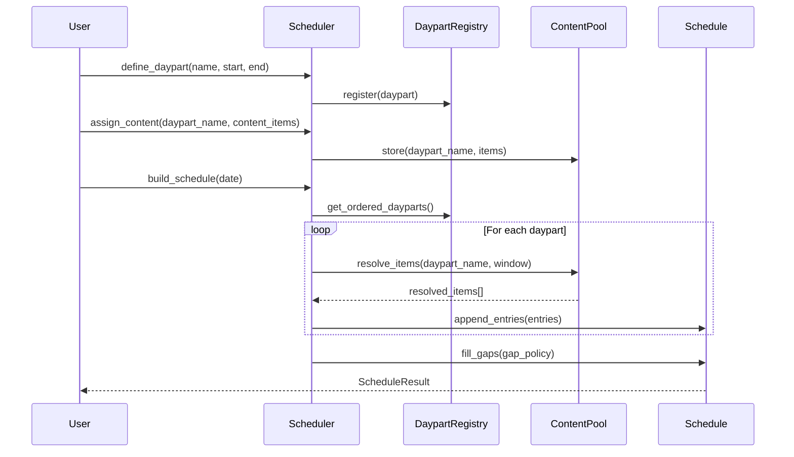

# Design Document: day2 — Daypart Scheduler

## Overview

`day2` is a clean, standalone daypart scheduler that divides a 24-hour day into named time blocks (e.g., morning, afternoon, primetime, overnight) and schedules content or tasks into those blocks. It is designed as a self-contained library + CLI with no dependency on the akiratv codebase.

---

## Main Algorithm/Workflow



---

## Core Interfaces/Types

```pascal
STRUCTURE TimeWindow
  start_minutes: Integer   -- minutes from midnight (0..1440)
  end_minutes:   Integer   -- exclusive end, must be > start_minutes
END STRUCTURE

STRUCTURE Daypart
  name:   String           -- unique identifier, e.g. "primetime"
  label:  String           -- display name, e.g. "Prime Time"
  window: TimeWindow
END STRUCTURE

STRUCTURE ContentItem
  id:         String
  title:      String
  duration_s: Integer      -- duration in seconds, must be > 0
  tags:       List[String]
  metadata:   Map[String, Any]
END STRUCTURE

STRUCTURE Assignment
  daypart_name: String
  items:        List[ContentItem]
  strategy:     FillStrategy   -- SEQUENTIAL | SHUFFLE | REPEAT
END STRUCTURE

STRUCTURE ScheduleEntry
  daypart_name: String
  start_minutes: Integer
  end_minutes:   Integer
  item:          ContentItem
  overflow:      Boolean       -- true if item extends past daypart window
END STRUCTURE

STRUCTURE ScheduleResult
  date:    Date
  entries: List[ScheduleEntry]
  gaps:    List[TimeWindow]    -- unscheduled windows
  errors:  List[String]
END STRUCTURE

ENUM FillStrategy
  SEQUENTIAL   -- play items in order, resume across days
  SHUFFLE      -- randomize each day
  REPEAT       -- loop items to fill window
END ENUM

ENUM GapPolicy
  LEAVE_EMPTY  -- gaps remain unscheduled
  FILL_RANDOM  -- fill with any available content
  FILL_TAG     -- fill with items matching a tag
END ENUM
```

---

## Key Functions with Formal Specifications

### `parse_hhmm(time_str) -> Integer`

```pascal
FUNCTION parse_hhmm(time_str: String) -> Integer
```

**Preconditions:**
- `time_str` matches pattern `HH:MM` where `HH` ∈ [00..24] and `MM` ∈ [00..59]
- Special case `"24:00"` is valid (represents end-of-day = 1440 minutes)

**Postconditions:**
- Returns integer minutes from midnight in range [0..1440]
- `parse_hhmm("00:00") = 0`
- `parse_hhmm("24:00") = 1440`
- `parse_hhmm("06:30") = 390`

**Raises:** `ValueError` if format is invalid

---

### `format_hhmm(minutes) -> String`

```pascal
FUNCTION format_hhmm(minutes: Integer) -> String
```

**Preconditions:**
- `minutes` ∈ [0..1440]

**Postconditions:**
- Returns `"HH:MM"` string
- `format_hhmm(0) = "00:00"`
- `format_hhmm(1440) = "24:00"`
- Inverse of `parse_hhmm`: `format_hhmm(parse_hhmm(s)) = s` for all valid `s`

---

### `validate_daypart(daypart) -> List[String]`

```pascal
FUNCTION validate_daypart(daypart: Daypart) -> List[String]
```

**Preconditions:**
- `daypart` is a non-null Daypart struct

**Postconditions:**
- Returns empty list if daypart is valid
- Returns list of error strings describing each violation
- Checks: non-empty name, `start_minutes < end_minutes`, window within [0..1440]

---

### `detect_gaps(dayparts, day_start, day_end) -> List[TimeWindow]`

```pascal
FUNCTION detect_gaps(
  dayparts:  List[Daypart],
  day_start: Integer,   -- default 0
  day_end:   Integer    -- default 1440
) -> List[TimeWindow]
```

**Preconditions:**
- All dayparts are valid (no overlaps)
- `day_start < day_end`
- `day_start >= 0`, `day_end <= 1440`

**Postconditions:**
- Returns list of `TimeWindow` representing unscheduled intervals
- If `dayparts` is empty → returns `[TimeWindow(day_start, day_end)]`
- All returned windows are non-overlapping and sorted by `start_minutes`
- Union of all daypart windows + returned gaps = `[day_start, day_end]`

**Loop Invariant:** `cursor` always points to the end of the last processed daypart; all time before `cursor` is accounted for

---

### `resolve_items(assignment, window, episodic_state) -> List[ScheduleEntry]`

```pascal
FUNCTION resolve_items(
  assignment:     Assignment,
  window:         TimeWindow,
  episodic_state: Map[String, Integer]  -- daypart_name -> next_item_index
) -> List[ScheduleEntry]
```

**Preconditions:**
- `assignment.items` is non-empty
- `window.start_minutes < window.end_minutes`
- `episodic_state` may be empty (treated as all-zero indices)

**Postconditions:**
- Returns entries that fit within `window` (or overflow by at most one item)
- Total scheduled duration ≤ window duration + last item duration
- `episodic_state` is mutated to advance the index for `SEQUENTIAL` strategy
- For `SHUFFLE`: order is randomized, state index not advanced
- For `REPEAT`: items loop until window is filled

**Loop Invariant:** `cursor_minutes` is always ≥ `window.start_minutes` and increases monotonically

---

### `build_schedule(dayparts, assignments, date, gap_policy, episodic_state) -> ScheduleResult`

```pascal
FUNCTION build_schedule(
  dayparts:       List[Daypart],
  assignments:    Map[String, Assignment],
  date:           Date,
  gap_policy:     GapPolicy,
  episodic_state: Map[String, Integer]
) -> ScheduleResult
```

**Preconditions:**
- `dayparts` is non-empty and contains no overlapping windows
- All `assignments` keys reference valid daypart names
- `date` is a valid calendar date

**Postconditions:**
- `result.entries` is sorted by `start_minutes`
- `result.gaps` contains all unscheduled windows (empty if `gap_policy != LEAVE_EMPTY` and content is available)
- `result.errors` is empty on full success
- Episodic state is updated for all `SEQUENTIAL` assignments

---

### `has_overlap(dayparts) -> Boolean`

```pascal
FUNCTION has_overlap(dayparts: List[Daypart]) -> Boolean
```

**Preconditions:**
- `dayparts` may be empty

**Postconditions:**
- Returns `true` if any two dayparts share any minute
- Returns `false` if all windows are disjoint or list has ≤ 1 element
- O(n log n) via sort + linear scan

---

## Algorithmic Pseudocode

### Main Schedule Build

```pascal
ALGORITHM build_schedule(dayparts, assignments, date, gap_policy, episodic_state)
INPUT:  dayparts, assignments, date, gap_policy, episodic_state
OUTPUT: ScheduleResult

BEGIN
  ASSERT NOT has_overlap(dayparts)

  sorted_parts ← SORT dayparts BY window.start_minutes ASC
  entries      ← []
  errors       ← []

  FOR each dp IN sorted_parts DO
    ASSERT entries are sorted and non-overlapping up to dp.window.start_minutes

    IF dp.name NOT IN assignments THEN
      CONTINUE
    END IF

    assignment ← assignments[dp.name]
    new_entries ← resolve_items(assignment, dp.window, episodic_state)
    entries.extend(new_entries)
  END FOR

  gaps ← detect_gaps(sorted_parts, 0, 1440)

  IF gap_policy ≠ LEAVE_EMPTY THEN
    fill_entries ← fill_gaps(gaps, assignments, gap_policy)
    entries.extend(fill_entries)
  END IF

  entries ← SORT entries BY start_minutes ASC

  ASSERT entries are sorted by start_minutes
  ASSERT all entry windows are within [0, 1440]

  RETURN ScheduleResult(date, entries, gaps, errors)
END
```

**Preconditions:** dayparts non-empty, no overlaps
**Postconditions:** result.entries sorted, all windows valid
**Loop Invariant:** all entries appended so far are sorted and non-overlapping

---

### Gap Detection

```pascal
ALGORITHM detect_gaps(dayparts, day_start, day_end)
INPUT:  dayparts, day_start=0, day_end=1440
OUTPUT: List[TimeWindow]

BEGIN
  IF dayparts IS EMPTY THEN
    RETURN [TimeWindow(day_start, day_end)]
  END IF

  sorted ← SORT dayparts BY window.start_minutes ASC
  gaps   ← []
  cursor ← day_start

  FOR each dp IN sorted DO
    ASSERT cursor <= dp.window.start_minutes  -- no overlap invariant

    IF cursor < dp.window.start_minutes THEN
      gaps.append(TimeWindow(cursor, dp.window.start_minutes))
    END IF

    cursor ← dp.window.end_minutes
  END FOR

  IF cursor < day_end THEN
    gaps.append(TimeWindow(cursor, day_end))
  END IF

  ASSERT union(gaps) + union(daypart_windows) = [day_start, day_end]

  RETURN gaps
END
```

---

### Item Resolution (Sequential)

```pascal
ALGORITHM resolve_items_sequential(assignment, window, episodic_state)
INPUT:  assignment, window, episodic_state
OUTPUT: List[ScheduleEntry]

BEGIN
  items   ← assignment.items
  n       ← LENGTH(items)
  idx     ← episodic_state.get(assignment.daypart_name, 0) MOD n
  cursor  ← window.start_minutes
  entries ← []

  WHILE cursor < window.end_minutes DO
    ASSERT cursor >= window.start_minutes  -- cursor only moves forward

    item     ← items[idx MOD n]
    duration ← CEIL(item.duration_s / 60)
    end_min  ← cursor + duration
    overflow ← end_min > window.end_minutes

    entries.append(ScheduleEntry(
      daypart_name  = assignment.daypart_name,
      start_minutes = cursor,
      end_minutes   = MIN(end_min, window.end_minutes),
      item          = item,
      overflow      = overflow
    ))

    cursor ← end_min
    idx    ← (idx + 1) MOD n
  END WHILE

  episodic_state[assignment.daypart_name] ← idx

  ASSERT cursor >= window.end_minutes
  RETURN entries
END
```

---

## Example Usage

```pascal
-- Define dayparts
morning   ← Daypart("morning",   "Morning",    TimeWindow(parse_hhmm("06:00"), parse_hhmm("12:00")))
afternoon ← Daypart("afternoon", "Afternoon",  TimeWindow(parse_hhmm("12:00"), parse_hhmm("18:00")))
primetime ← Daypart("primetime", "Prime Time", TimeWindow(parse_hhmm("18:00"), parse_hhmm("23:00")))
overnight ← Daypart("overnight", "Overnight",  TimeWindow(parse_hhmm("23:00"), parse_hhmm("24:00")))

-- Assign content
news_items  ← [ContentItem("n1", "Morning News", 1800, ["news"], {})]
movie_items ← [ContentItem("m1", "Feature Film", 7200, ["movie"], {})]

assignments ← {
  "morning":   Assignment("morning",   news_items,  SEQUENTIAL),
  "primetime": Assignment("primetime", movie_items, SHUFFLE)
}

-- Build schedule
state  ← {}
result ← build_schedule(
  [morning, afternoon, primetime, overnight],
  assignments,
  date(2025, 1, 1),
  FILL_RANDOM,
  state
)

-- Inspect result
FOR each entry IN result.entries DO
  PRINT format_hhmm(entry.start_minutes) + " - " + format_hhmm(entry.end_minutes) + ": " + entry.item.title
END FOR

FOR each gap IN result.gaps DO
  PRINT "Gap: " + format_hhmm(gap.start_minutes) + " - " + format_hhmm(gap.end_minutes)
END FOR
```

---

## Correctness Properties

```pascal
-- P1: Time string round-trip
ASSERT FOR ALL s IN valid_hhmm_strings:
  format_hhmm(parse_hhmm(s)) = s

-- P2: Gap coverage
ASSERT FOR ALL dayparts, gaps = detect_gaps(dayparts, 0, 1440):
  union(daypart_windows) + union(gaps) = [0, 1440]

-- P3: No overlapping entries in result
ASSERT FOR ALL i < j IN result.entries:
  entries[i].end_minutes <= entries[j].start_minutes

-- P4: Entries within daypart windows (ignoring overflow flag)
ASSERT FOR ALL entry IN result.entries WHERE NOT entry.overflow:
  entry.start_minutes >= daypart(entry.daypart_name).window.start_minutes AND
  entry.end_minutes   <= daypart(entry.daypart_name).window.end_minutes

-- P5: Sequential episodic state advances
ASSERT FOR ALL SEQUENTIAL assignments:
  episodic_state_after[name] = (episodic_state_before[name] + items_played) MOD len(items)

-- P6: Empty daypart list produces single full-day gap
ASSERT detect_gaps([], 0, 1440) = [TimeWindow(0, 1440)]

-- P7: Overlap detection is symmetric
ASSERT has_overlap([a, b]) = has_overlap([b, a])
```
