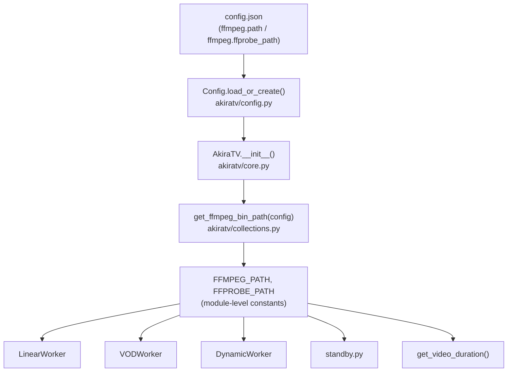
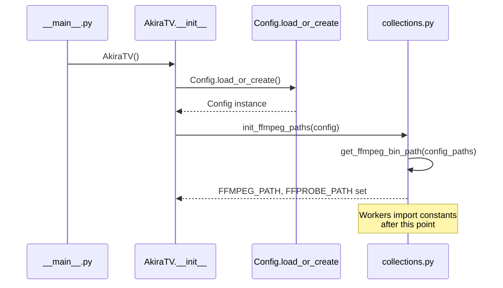

# Design Document: FFmpeg/FFprobe Configurable Binary Paths

## Overview

Add optional `ffmpeg.path` and `ffmpeg.ffprobe_path` fields to `config.json` so users can explicitly point AkiraTV at specific FFmpeg/FFprobe binaries. When these fields are absent, the existing auto-detection logic in `collections.py` runs unchanged, preserving full backward compatibility.

## Architecture

The change touches three layers: the config schema, the path-resolution function, and the startup wiring that connects them. No worker code changes are needed — workers already consume `FFMPEG_PATH` / `FFPROBE_PATH` as module-level constants.



### Startup Sequence



## Components and Interfaces

### Component 1: `config.py` — Schema Extension

**Purpose**: Declare the two new optional fields in `DEFAULT_CONFIG` and expose a helper method for reading them.

**Interface**:
```python
# New fields added to DEFAULT_CONFIG["ffmpeg"]
DEFAULT_CONFIG = {
    "ffmpeg": {
        "path": None,          # str | None — overrides auto-detection
        "ffprobe_path": None,  # str | None — overrides auto-detection
        "hwaccel": "cuda",
        # ... existing fields unchanged
    },
    # ... rest of config unchanged
}

class Config:
    def get_ffmpeg_paths(self) -> tuple[str | None, str | None]:
        """Return (ffmpeg_path, ffprobe_path) from config, or (None, None) if not set."""
        ffmpeg_section = self.data.get("ffmpeg", {})
        return (
            ffmpeg_section.get("path") or None,
            ffmpeg_section.get("ffprobe_path") or None,
        )
```

**Responsibilities**:
- Store `None` as the default so absent keys and explicit `null` in JSON both mean "use auto-detection"
- Treat empty string `""` the same as `None` (the `or None` coercion handles this)
- `_merge_with_defaults` already deep-merges, so existing configs without these keys will inherit `None` automatically

### Component 2: `collections.py` — Path Resolution

**Purpose**: Accept optional override paths and short-circuit auto-detection when they are provided.

**Interface**:
```python
def get_ffmpeg_bin_path(
    ffmpeg_override: str | None = None,
    ffprobe_override: str | None = None,
) -> tuple[str, str]:
    """
    Resolve ffmpeg/ffprobe binary paths.

    Priority:
      1. Caller-supplied overrides (from config.json)
      2. Bundled binary at akiratv/bin/
      3. System PATH (shutil.which)
      4. Windows default C:\\ffmpeg\\bin\\
      5. Bare string fallback "ffmpeg" / "ffprobe"
    """

def init_ffmpeg_paths(config: "Config") -> None:
    """
    Called once at startup. Reads override paths from config and
    (re)assigns the module-level FFMPEG_PATH / FFPROBE_PATH constants.
    """
    global FFMPEG_PATH, FFPROBE_PATH
    ffmpeg_override, ffprobe_override = config.get_ffmpeg_paths()
    FFMPEG_PATH, FFPROBE_PATH = get_ffmpeg_bin_path(ffmpeg_override, ffprobe_override)
```

**Responsibilities**:
- Keep the existing four-step fallback chain intact when no overrides are given
- Log which path was chosen and why (at `INFO` level) so users can diagnose misconfiguration
- Validate that an override path actually exists on disk; log a warning and fall through to auto-detection if it does not

### Component 3: `core.py` — Startup Wiring

**Purpose**: Call `init_ffmpeg_paths` after config is loaded, before any workers start.

**Interface**:
```python
class AkiraTV:
    def __init__(self):
        self.config = Config.load_or_create()
        
        # NEW: apply config-driven path overrides before workers import constants
        from akiratv.collections import init_ffmpeg_paths
        init_ffmpeg_paths(self.config)
        
        # ... rest of __init__ unchanged
```

**Responsibilities**:
- Call `init_ffmpeg_paths` before `TranscodingService` or any worker is instantiated, so the module-level constants are set before first use
- No other changes to `core.py`

## Data Models

### Config Schema Addition

```python
# Within DEFAULT_CONFIG["ffmpeg"]
{
    "path": None,          # Optional[str] — absolute or relative path to ffmpeg binary
    "ffprobe_path": None,  # Optional[str] — absolute or relative path to ffprobe binary
}
```

**Validation Rules**:
- Both fields are independently optional; you can override only one
- `null` / `None` / `""` all mean "use auto-detection"
- If a non-null path is provided but the file does not exist, log a `WARNING` and fall back to auto-detection (do not crash)
- Paths may be absolute (`/usr/local/bin/ffmpeg`) or relative to the working directory

### Example `config.json` Fragment

```json
{
  "ffmpeg": {
    "path": "/opt/custom-ffmpeg/bin/ffmpeg",
    "ffprobe_path": "/opt/custom-ffmpeg/bin/ffprobe",
    "hwaccel": "cuda",
    "enable_subtitles": false,
    "transcoding": { "enabled": false }
  }
}
```

## Error Handling

### Scenario 1: Override path does not exist

**Condition**: User sets `ffmpeg.path` to a path that doesn't exist on disk.  
**Response**: Log `WARNING: Configured ffmpeg path '/bad/path' not found, falling back to auto-detection.` then continue with the normal four-step fallback.  
**Recovery**: Auto-detection proceeds; startup is not interrupted.

### Scenario 2: Override path exists but is not executable

**Condition**: File exists but `os.access(path, os.X_OK)` returns `False`.  
**Response**: Log `WARNING: Configured ffmpeg path '/path/ffmpeg' is not executable, falling back to auto-detection.`  
**Recovery**: Same as Scenario 1.

### Scenario 3: Only one of the two paths is overridden

**Condition**: User sets `ffmpeg.path` but leaves `ffmpeg.ffprobe_path` as `null`.  
**Response**: Apply the override for ffmpeg, run auto-detection independently for ffprobe. Both are resolved independently.  
**Recovery**: Normal operation.

### Scenario 4: Config file missing the new keys (existing installs)

**Condition**: User's `config.json` predates this feature and has no `path` / `ffprobe_path` keys.  
**Response**: `_merge_with_defaults` fills them in as `None`; `get_ffmpeg_paths()` returns `(None, None)`; auto-detection runs as before.  
**Recovery**: Fully transparent — no user action required.

## Testing Strategy

### Unit Testing Approach

Test `get_ffmpeg_bin_path` in isolation with mocked filesystem state:

- Override provided and file exists → returns override path
- Override provided but file missing → falls back to next step
- Override is `None` → skips to bundled binary check
- Both overrides `None`, no bundled binary, system PATH has ffmpeg → returns system path
- All detection steps fail → returns bare `"ffmpeg"` / `"ffprobe"` strings

Test `Config.get_ffmpeg_paths`:

- Config with explicit paths → returns those paths
- Config with `null` values → returns `(None, None)`
- Config with empty strings → returns `(None, None)` (coerced)
- Config missing the keys entirely → returns `(None, None)`

### Property-Based Testing Approach

**Property Test Library**: `hypothesis`

Properties to verify:

- For any non-empty string path that exists on disk, `get_ffmpeg_bin_path(path, path)` returns exactly that path (override always wins when valid)
- For any config dict, `get_ffmpeg_paths()` never raises an exception
- `_merge_with_defaults` with any user dict always produces a result where `data["ffmpeg"]["path"]` exists as a key

### Integration Testing Approach

- Start AkiraTV with a config pointing to a real ffmpeg binary in a temp directory; verify `FFMPEG_PATH` equals that path after `init_ffmpeg_paths` runs
- Start AkiraTV with no path overrides; verify `FFMPEG_PATH` is resolved via auto-detection (bundled or system)

## Dependencies

No new external dependencies. Uses only stdlib modules already present in the codebase: `os`, `shutil`, `pathlib.Path`.

## Correctness Properties

*A property is a characteristic or behavior that should hold true across all valid executions of a system — essentially, a formal statement about what the system should do. Properties serve as the bridge between human-readable specifications and machine-verifiable correctness guarantees.*

### Property 1: Override Priority

*For any* config where `ffmpeg.path` is set to a non-empty string that exists on disk and is executable, `get_ffmpeg_bin_path` must return exactly that string as `FFMPEG_PATH`. The same holds symmetrically for `ffprobe_path` and `FFPROBE_PATH`.

**Validates: Requirements 2.1, 2.2**

### Property 2: Graceful Fallback on Invalid Path

*For any* non-empty string that does not correspond to an existing, executable file on disk, passing it as an override to `get_ffmpeg_bin_path` must produce a result that is not equal to that string, and the result must be a non-empty string (auto-detection ran successfully).

**Validates: Requirements 3.1, 3.2, 3.3, 3.4, 3.5**

### Property 3: Backward Compatibility

*For any* config dict that lacks `ffmpeg.path` and `ffmpeg.ffprobe_path` keys, `Config._merge_with_defaults` must produce a merged dict where both keys exist with value `None`, and `get_ffmpeg_paths()` must return `(None, None)`, causing `get_ffmpeg_bin_path(None, None)` to produce the same result as the pre-feature auto-detection.

**Validates: Requirements 4.1, 4.2, 4.3**

### Property 4: Independent Resolution

*For any* valid override path for `ffmpeg.path` and any value (including `None`) for `ffprobe_path`, the resolved `FFMPEG_PATH` equals the override and the resolved `FFPROBE_PATH` is determined solely by the `ffprobe_path` argument — never influenced by the `ffmpeg.path` value. The same independence holds in the reverse direction.

**Validates: Requirements 2.3, 2.4, 2.5**

### Property 5: No Crash on Any Config

*For any* config dict (including malformed, empty, or missing-key variants), calling `init_ffmpeg_paths(config)` must never raise an exception, and after the call `FFMPEG_PATH` and `FFPROBE_PATH` must both be non-empty strings.

**Validates: Requirements 5.3**

### Property 6: get_ffmpeg_paths Null/Empty Coercion

*For any* config where `ffmpeg.path` and/or `ffmpeg.ffprobe_path` are `null`, `""`, or absent, `Config.get_ffmpeg_paths()` must return `None` for those fields and must never raise an exception.

**Validates: Requirements 1.3, 1.4, 1.5**
